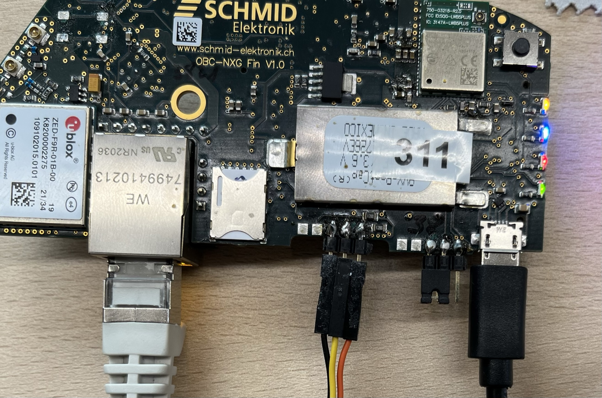

# Readme

This Layer customizes the Karo Layer for the OBC NGX devices.

Some entry points;

- [initial BSP setup](https://karo-electronics.github.io/docs/yocto-guide/nxp/setup.html)

- [customize BSB, create Layer, etc](https://karo-electronics.github.io/docs/yocto-guide/nxp/customizing.html)

- [Flash image](https://karo-electronics.github.io/docs/software-documentation/flashtools/stm32-programmer/index.html)

- [The Yocto Manual](https://docs.yoctoproject.org/3.1.20/singleindex.html)

  

## First time setup
Get an Ubuntu 18.04 (20.04 does not work, yocto gatesgarth is not there). WSL2 works

```bash
# get all used tools
sudo apt install gawk wget git diffstat unzip texinfo gcc build-essential chrpath socat cpio python3 python3-pip python3-pexpect xz-utils debianutils iputils-ping python3-git python3-jinja2 libegl1-mesa libsdl1.2-dev pylint3 xterm python3-subunit mesa-common-dev curl python libncurses-dev

# repotool
mkdir ~/bin
curl https://storage.googleapis.com/git-repo-downloads/repo > ~/bin/repo
chmod a+x ~/bin/repo

# add it to bashrc
export PATH=~/bin:$PATH

# get karo distro
mkdir obc-yocto
cd obc-yocto
repo init -u https://github.com/schmid-elektronik/karo-bsp -b gatesgarth
repo sync

# copy following files to  <home>/obc-yocto/release
laird-lwb5plus-sdio-sa-firmware-9.15.0.14.tar.bz2
laird-lwb5plus-usb-sa-firmware-9.15.0.14.tar.bz2 
obc-services-karo_1.1.8.tar.gz

# set machine and build folder, initially you need to run it twice
DISTRO=obc-base MACHINE=qsmp-1570-bb source setup-environment build-obc-1570-bb/

# setup "global" cache- and download-directory (you could set path to a network share)
# in conf/local.conf
DL_DIR ?= "/home/mas/yoctocache/downloads"
SSTATE_DIR ?= "/home/mas/yoctocache/sstate-cache"

# add the KARO cache
SSTATE_MIRRORS ?= "\
    file://.* http://sstate.yoctoproject.org/PATH;downloadfilename=PATH \
    file://.* http://sstate.karo-electronics.de/gatesgarth/PATH \
"

# you manually need to add obc layer in conf/bblayers.conf
${BSPDIR}/layers/meta-obc-kernel \
${BSPDIR}/layers/meta-laird-cp \

bitbake obc-image-bb
```


Manually adding the our own Layers is just a workaround. We could resolve it by providing our own `setup-environment` script

```bash
cp setup-environment <own layer>
cp bblaysers.conf.sample <own layer>
# customize files and add it to the bsp-repo <youbuild>/.repo/manifests/default.xml

# the better option would be cutom template, but its not supported by karo
# https://docs.yoctoproject.org/3.1.19/singleindex.html#creating-a-custom-template-configuration-directory
# https://github.com/karo-electronics/meta-karo/issues/9
```


## Basic Yocto Build

once your set, it's easy..

```bash
# on the prepared VM
cd ~/obc-yocto/
#DISTRO=obc-base MACHINE=qsmp-1570 source setup-environment build-obc-1570-base/
DISTRO=obc-base MACHINE=qsmp-1570-bb source setup-environment build-obc-1570-bb/
DISTRO=obc-base MACHINE=qsmp-1570-fin source setup-environment build-obc-1570-fin/

# image
#bitbake karo-image-base
bitbake obc-image-bb
bitbake obc-image-fin
# ---> Flash image

# SDK = compiler, header, ++
bitbake karo-image-base -c populate_sdk
cd tmp/deploy/sdk 
# deploy/install sdk to /home/karo/bin/karo_sdk/

# to use the toolchain
. /home/karo/bin/karo_sdk/environment-setup-armv7vet2hf-neon-poky-linux-gnueabi
```


## Flash image

Install [STM32 CubeProgrammer](https://karo-electronics.github.io/docs/software-documentation/flashtools/stm32-programmer/index.html)

connect USB, Serial FTDI cable and Boot Jumper as in the picture

If working on WSL, consider [connecting USB to WSL](https://learn.microsoft.com/en-us/windows/wsl/connect-usb)



```bash
# Programmer Location = /home/karo/bin/stm32_cube_programmer
# already in PATH

# cd to image folder
cd <BUILD_FOLDER>/tmp/deploy/images/qsmp-1570-

# get USB number
STM32_Programmer_CLI -l usb

# flash image
# ---> set bootmode jumper
STM32_Programmer_CLI -c port=usb1 -w flashlayout_obc-image-fin/FlashLayout_emmc_stm32mp157c-qsmp-1570-trusted.tsv

# from uboot, you can mount this stuff as massstorage
# Does not work since we removed programming usb from devicetree
=> ums 0 mmc 0

# or just modify those partitions directly in system, eg bootpartition
lsblk
mount /dev/mmcblk0p2 /boot/
```


### Setup Karo Module

When using a Karo Module for the first time. The uboot environment needs to be set manually, [since this can not be done with the STM32_Programmer](https://karo-electronics.github.io/docs/software-documentation/flashtools/stm32-programmer/index.html#u-boot-environment).

```bash
# Break into U-Boot prompt again by hitting any key.

# set default environment
env default -a
saveenv
reset

# adapt bootargs and devicetreefile for our needs
setenv append_bootargs 'init=/sbin/init'
setenv dtbfile /stm32mp157c-qsmp-1570-bb.dtb
saveenv

# set use different devicetreefile for Backbone and fin
setenv dtbfile /stm32mp157c-qsmp-1570-fin.dtb

# you may want to remove the 'debug' argumnent in default_bootargs, this will print less on console
setenv default_bootargs 'setenv bootargs console=ttySTM0,115200 ro panic=-1 loglevel=1'
```
